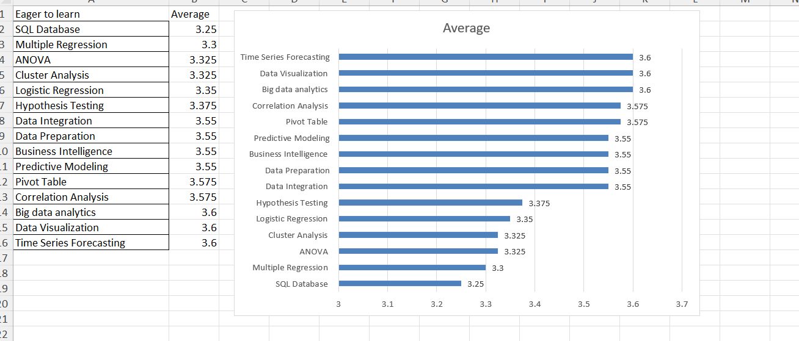

# Data-Mining-1
# Data Analysis of Learner Eagerness

The averages for all topics fall within a fairly narrow band, ranging from 3.25 to 3.6. This shows that learners are consistently engaged across all areas, without any extreme differences in preference. The chart presents a smooth progression, with the higher-scoring topics clustered around 3.55 to 3.6 and the lower-scoring ones closer to 3.25 to 3.35.  

The topics that scored the highest, at 3.6, are **Time Series Forecasting**, **Data Visualization**, and **Big Data Analytics**. These areas represent the strongest eagerness to learn and highlight a clear preference for advanced and modern analytics skills. Close behind are **Correlation Analysis**, **Pivot Table**, **Predictive Modeling**, **Business Intelligence**, **Data Preparation**, and **Data Integration**, all scoring between 3.55 and 3.575. This reflects substantial interest in both applied statistical methods and practical data-handling tools. Altogether, the results show a strong inclination toward data-driven decision-making skills that combine visualization, integration, and forecasting, which are highly relevant in modern business and analytics environments.  

On the other hand, **SQL Database** (3.25), **Multiple Regression** (3.3), **ANOVA** (3.325), and **Cluster Analysis** (3.325) received the lowest enthusiasm. Although their averages remain above the midpoint, these topics are clearly less appealing compared to the more application-oriented areas. One possible reason is their perceived technical complexity, or perhaps learners feel they already have familiarity with these foundational concepts and are more motivated to pursue newer, advanced topics.  

Taken together, the results indicate that learners are most eager to expand into forward-looking, applied analytics areas such as forecasting, visualization, and big data, while showing relatively less excitement for traditional statistical methods and database fundamentals. A curriculum that emphasizes modern applications and integration with business intelligence would therefore align best with learner interests, while foundational topics may benefit from being reframed or embedded into applied projects to keep engagement strong.  
